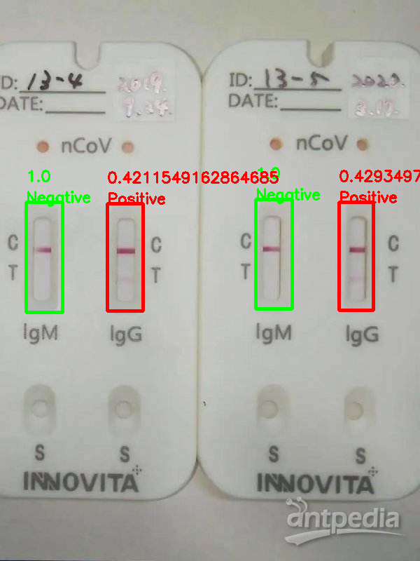

# 1、Antigener_Detector思路说明

Antigener Detector通过两种方法串行，来完成检测。从而提高阳性样本的召回率。

首先是使用在数据集([新冠抗原检测试剂数据集](https://ai.baidu.com/easydl/app/invitation?token=3cea8a6a5592e25101e1e8dbaa0ad1f7))上训练的ppyoloe-s模型进行目标检测。紧接着使用传统视觉算法对检测得到的主体进行后处理。最后由两者结果共同进行判断。

之所以这样做，有以下两方面原因：
    
    1、数据集阳性样本量不够多。（欢迎各位开发者朋友们对上述数据集的进一步完善做出贡献。）
    2、当检测试剂棒上的红杠颜色很浅时，很容易误识别成阴性。这在实际应用中是绝对不允许的。

因此，本着“宁可错检阴性样本，也绝不放过任何一个阳性样本”的原则，使用了上述思路进行检测。

# 2、代码结构


    │  detector.py             #目标检测器
    │  detpreprocess.py        #目标检测前图像预处理部分
    │  main.py				   #主函数。
    │  postprocess.py
    │  predictor.py
    │  preprocess.py
    │  Readme.md        
    ├─params
        │      infer_cfg.yml   #如若重新训练检测器，不要替换掉该文件，可将新训练的与之对照修改
        │      model.pdiparams
        │      model.pdiparams.info
        │      model.pdmodel
        │      
    ├─test_images
        │      detect_output.png
        │      FDLOw1RXoAY6Aat.jpg
        │      FEeigpzX0AEmqW-.png
        │      FIHmHpwWQAcKWK3.jpg
        │      positive.jpeg
    ├─utils
        │  config.py
        │  logger.py
        │  init.py  

# 3、使用方法

**<u>使用时一定要注意修改main.py文件里的相关路径。</u>**

```python
from antigener_detector import antigener_classification

img = cv2.imread('xxx')
results = antigener_classification(img)
print(results)
"""
输出results的格式如下：
{'Positive':[a, b, c, ...., n], 'Negative':[a, b, c, ...., n]}
a, b, c, ...., n的格式如下：
[x1, y1, x2, y2, confidence]
左上角坐标，右下角坐标以及置信度。
"""
```


# 4、检测效果展示



# 5、继续改进思路

由于这是一种两个方法串行检测的方案。因此，提升任何一个的检测性能，都会对该方案的性能提升有一定帮助。而改进思路也很显然：

    1、改进目标检测本身。（从模型角度以及数据集角度）
    2、进一步完善传统视觉算法方案。

# 6、Update Codes更新日志
2022.5.11算法更新：
本次更新替换了原算法中的第二阶段。而是通过建立阴性、阳性样本的特征向量数据库。当目标检测完成之后，如果目标检测得到的目标置信度小于设置的negative_threshed和positive_threshed两个阈值，则使用训练好的分类模型对感兴趣区域进行特征提取，之后在已经构建的特征向量数据库中进行搜索，找到相似度最高的特征向量，即认为该样本标签与数据库中样本标签一直，从而提升算法的容错率。

建立数据库的方法：
```python
python .\build_gallary.py -c .\params\build_index.yaml
```
使用方法：
```python
from antigener_detector import antigener_classification_update_1、Searcher

img = cv2.imread('xxx')
searcher, id_map = Searcher()
results = antigener_classification_update_1(img, searcher, id_map)
print(results)
"""
输出results的格式如下：
{'Positive':[a, b, c, ...., n], 'Negative':[a, b, c, ...., n]}
a, b, c, ...., n的格式如下：
[x1, y1, x2, y2, confidence]
左上角
```


By Hansansui 2022.05.09

AI Studio主页：[韩三岁个人主页](https://aistudio.baidu.com/aistudio/usercenter)

抗原检测模型训练项目链接：[AI Studio抗原检测](https://aistudio.baidu.com/aistudio/projectdetail/3965485?contributionType=1)

希望自己所做能尽绵薄之力，愿疫情早日结束！
